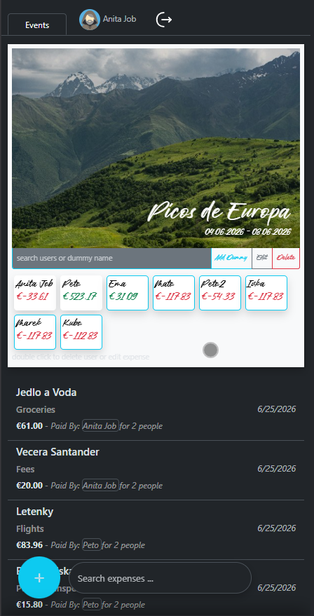
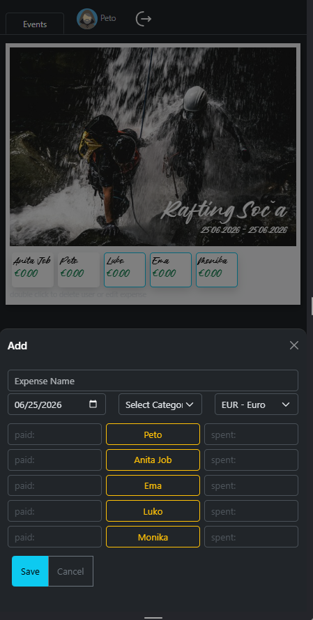
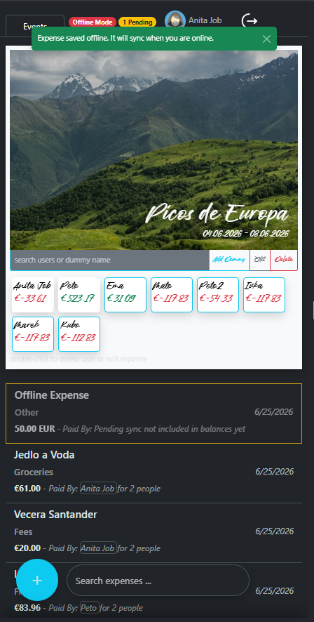

# Event Shared Expense Tracker

A web application for managing shared trip expenses. The application supports multi-currency expense tracking, AI-assisted features such as automatic expense categorization and receipt parsing.
Offline expense creation, and support for progressive web apps.

The project was built primarily as a personal/learning project to explore ASP.NET Core, Entity Framework Core, application architecture, testing, authentication, deployment, and cloud services and others.

https://eventsharedexpensetracker.azurewebsites.net/
(if trying out, its deployed on the free server, and it takes quite a while until the site warms up, until then it seems like it doesnt work, but its just parked. When its already cached this should not be an issue anymore.)

## Demo

A demo account is available for exploring the application:

```
Email:    AnitaJob@Test.com
Password: Test123!
```
Designed primary for mobile use, as thats where it will be used the most. Best use Chrome to install through install button. Other browsers will probably just add to home screen.

<h2>Screenshots</h2>

<table>
  <tr>
    <td align="center">
      <br>
      <b>Trips</b>
    </td>
    <td align="center">
      <br>
      <b>Trip Details</b>
    </td>
    <td align="center">
      <br>
      <b>Add Expense</b>
    </td>
    <td align="center">
      <br>
      <b>Offline Mode</b>
    </td>
  </tr>
</table>

## Features

* Create and manage trips with multiple participants
* Track shared expenses
* Flexible expense splitting between participants
* Trip and Expense categories and search
* HTMX-powered partial updates for a responsive user experience
* Image upload and compression
* ASP.NET Core Identity authentication
* Authorization rules for trips and expenses
* Structured error/result handling
* Automated tests
* Azure deployment with Azure SQL Database and Key Vault integration
* Support for multiple currencies with automatic conversion to trip base currency
* AI-assisted expense categorization based on expense name
* AI-assisted receipt parsing to prefill expense forms from uploaded receipt photos
* PWA support for installing as app on mobile and desktop
* Support for offline Expense entry, editing of pending drafts, and later sync with the server
* Support for offline Receipt storage, then syncing in the backgorund when online.
* Detect server unavailability even when the user is online and switch to cached/offline behavior
* Mobile-focused UI with floating actions and offcanvas forms

## Technology Stack

* ASP.NET Core MVC
* Entity Framework Core
* SQL Server / Azure SQL Database
* ASP.NET Core Identity
* HTMX, JavaScript
* Bootstrap
* Mapster
* xUnit
* OpenAI API
* Azure App Service
* Azure Key Vault

## Project Structure

The application is organized into several layers:

* Domain

  * Entities
  * Value Objects
  * Business rules

* Application

  * Commands
  * Queries
  * Services

* Infrastructure

  * Entity Framework Core
  * Repositories
  * External integrations

* Presentation

  * MVC Controllers
  * Razor Views
  * HTMX interactions

## Testing

The solution includes:

* Unit tests
* Integration tests
* GitHub Actions CI workflow

## Running Locally

Requirements:

* .NET 8 SDK
* SQL Server (or Azure SQL)

Clone the repository:

```bash
git clone https://github.com/Le40/EventSharedExpenseTracker.git
```

Apply migrations:

```bash
dotnet ef database update
```

Run the application:

```bash
dotnet run
```

### Planned Features

- Offline storing of receipts
- Integrating Participants and Friends management into Mobile controls
- Friends funcionality
- Vertical Slice Architecture or some form of hybrid
- Js to Ts
- Move to .NET 10

## Notes

This project is still evolving and is used as a place to experiment with new ideas and technologies while improving development practices.


