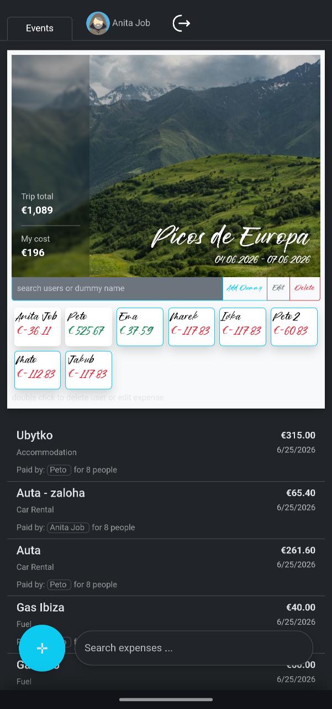
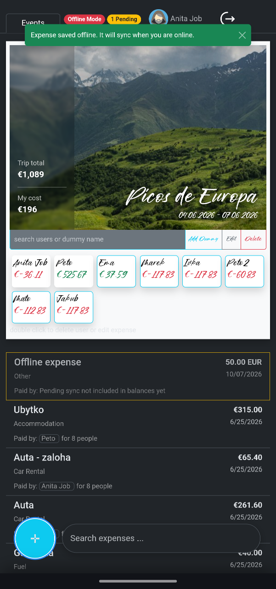
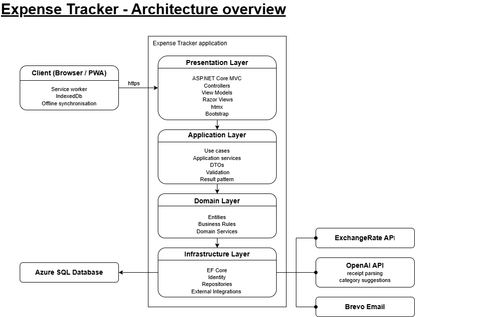
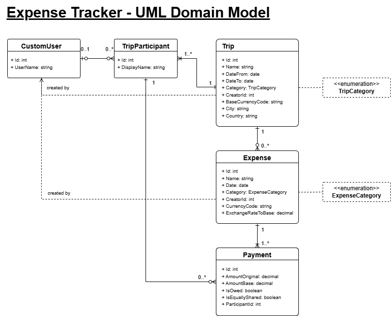
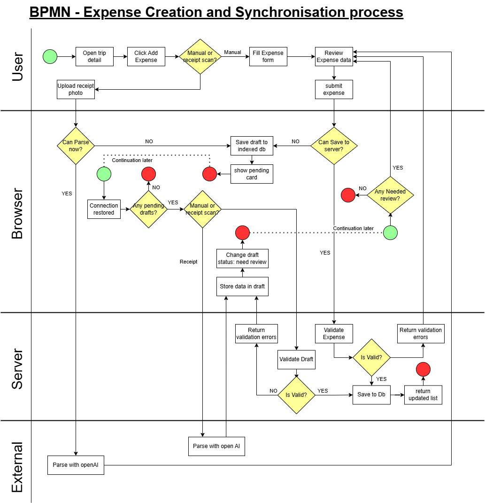




# Event Shared Expense Tracker

A mobile-first web application for managing shared trip expenses with multi-currency support, AI-assisted receipt parsing and offline-first capabilities.

## Why I Built This

This project was created as a personal learning project to explore modern .NET development, application architecture, cloud deployment, AI integration and offline-first web applications.

## Demo

https://eventsharedexpensetracker.azurewebsites.net/

⚠️ The application is hosted on a free Azure tier and may require 30–60 seconds to wake up after inactivity.

A demo account is available for exploring the application:

```
Email:    AnitaJob@Test.com
Password: Test123!
```
Designed primary for mobile use, as thats where it will be used the most. Best use Chrome to install through install button. Other browsers will probably just add to home screen.

<h2>Screenshots</h2>

<table>
  <tr>
    <td align="center">
      <br>
      <b>Trips</b>
    </td>
    <td align="center">
      <br>
      <b>Trip Details</b>
    </td>
    <td align="center">
      <br>
      <b>Add Expense</b>
    </td>
    <td align="center">
      <br>
      <b>Offline Mode</b>
    </td>
  </tr>
</table>

## Key Capabilities

- Offline expense creation and synchronization  
- AI receipt parsing and categorization  
- Multi-currency support  
- PWA installation support  
- Mobile-first experience

## Technical Highlights

- Offline-first architecture using IndexedDB and background synchronization
- AI-powered receipt parsing and expense categorization using OpenAI
- Multi-currency expense handling with automatic exchange rates
- Layered architecture with separation of Domain, Application, Infrastructure and Presentation concerns
- Mobile-focused PWA experience with install support and offline capabilities
- HTMX-powered partial updates reducing JavaScript complexity

## Technology Stack

* ASP.NET Core MVC
* Entity Framework Core
* SQL Server / Azure SQL Database
* ASP.NET Core Identity
* HTMX, JavaScript
* Bootstrap
* Mapster
* xUnit
* OpenAI API
* Azure App Service
* Azure Key Vault


## Testing

The solution includes:

* Unit tests
* Integration tests
* GitHub Actions CI workflow

## Architecture

The following diagrams provide a high-level overview of the application's structure and key workflows.

High-level overview of the application's layered architecture and external integrations.



<details>
<summary>Domain Model</summary>

Core domain entities and their relationships.



</details>

<details>
<summary>Expense Processing Workflow</summary>

Application workflow describing expense creation, offline processing and synchronization.



</details>


## Running Locally

Requirements:

* .NET 8 SDK
* SQL Server (or Azure SQL)

Clone the repository:

```bash
git clone https://github.com/Le40/EventSharedExpenseTracker.git
```

Apply migrations:

```bash
dotnet ef database update
```

Run the application:

```bash
dotnet run
```

## Roadmap

- Integrating Participants and Friends management into Mobile controls
- Change in Currency Rates API provider
- Friends funcionality
- Vertical Slice Architecture or some form of hybrid
- Js to Ts
- Move to .NET 10

## Notes

This project is still evolving and is used as a place to experiment with new ideas and technologies while improving development practices.


